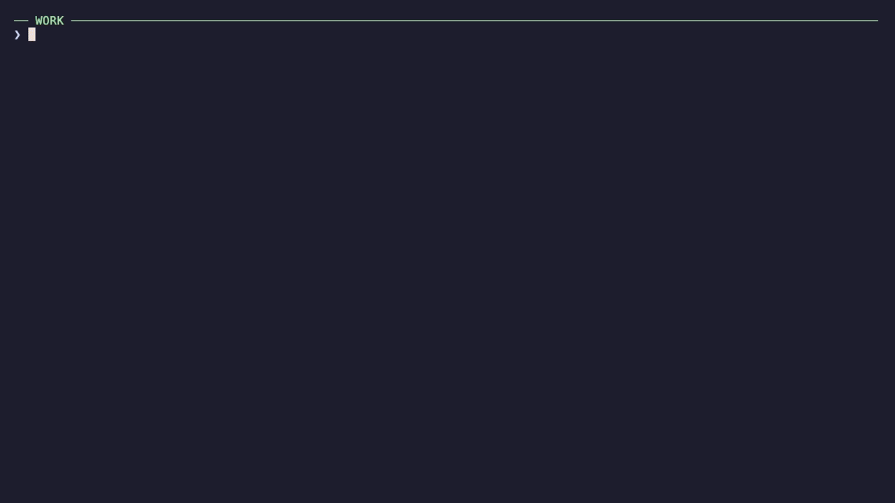

<p align="center">
  
</p>

<h1 align="center">hats</h1>

<p align="center">
  <a href="README.md">English</a> | 简体中文
</p>

<p align="center">让 Claude Code、Codex 及其他命令行 AI 工具同时使用不同 provider，互不干扰，无需来回切换全局配置。</p>

<p align="center">
  <a href="https://github.com/Colafornia/hats/actions/workflows/ci.yml"></a>
  <a href="LICENSE"></a>
</p>

<p align="center">
  
</p>

## 安装

**Homebrew（推荐）**

```bash
brew install colafornia/tap/hats
```

**独立安装脚本**

```bash
curl -fsSL https://raw.githubusercontent.com/Colafornia/hats/main/install.sh | sh
```

## 快速开始

为任意 AI CLI 创建一套运行配置（hat）：

```bash
hats add work claude
hats work
```

hat 中的环境变量只对它启动的进程生效，不会影响其他终端正在使用的 provider。

直接运行 `hats add` 即可进入配置向导。provider 的环境变量可通过 `hats edit` 配置，更多用法参见[高级配置](docs/advanced.md)。

## 为什么需要 hats

你可能在工作终端里使用公司网关，同时又想在另一个终端使用其它中转 API 或本地模型。传统的全局切换工具一次只能启用一套共享配置，无法让不同终端各自保持所需的 provider 配置。

hats 不修改全局配置。每个 hat 只作用于它启动的进程，因此多套 provider 配置可以同时运行、互不干扰。

为避免当前 Shell 中已有的变量意外覆盖配置，hats 会先清理 `ANTHROPIC_*`、`OPENAI_*`、`CODEX_*` 等继承来的 provider credentials，再注入当前 hat 的变量。

环境变量引用、本地模型和手动配置等进阶用法，请参阅[高级配置](docs/advanced.md)。

## 在多个 CLI 之间共享环境

如果 Claude 和 Codex 都连接同一个公司网关，可以让多个 hat 共用一份环境变量文件：

```toml
[profiles.write]
launch = "claude"
env_file = "~/.config/company-ai.env"

[profiles.review]
launch = "codex"
env_file = "~/.config/company-ai.env"
```

```bash
hats write
hats review  # 在另一个终端中运行
```

## 可选：隔离 CLI 状态

provider 环境默认按进程隔离，但同一个 CLI 的多个 hat 仍会共用其默认配置目录。如果还需要隔离设置、插件和历史记录，请添加 `--isolated`：

```bash
hats add personal codex --isolated
```

启用后，该 hat 会使用独立的配置目录，其中的设置、MCP 配置、插件和历史记录均不会与其他 hat 混用。目前 Codex 和 Claude Code 支持这一功能。

注意：这里隔离的是本地 CLI 状态，登录和 OAuth 行为仍由对应的 CLI 决定。

## 命令

```text
hats add [<名称> <命令...>]       创建一个 hat
hats <hat> [参数...]             启动一个 hat（等同于 hats run <hat>）
hats edit                        在 $EDITOR 中打开配置文件
hats ls                          列出所有 hat
```

<details>
<summary>更多命令</summary>

```text
hats                              显示 hat 列表和首次运行提示
hats init                         写入示例配置
hats add <名称> <命令...> --isolated
hats exec <hat> -- <命令>         使用该 hat 的环境运行另一个命令
hats which <hat>                  查看 hat，敏感信息会被隐藏
hats setenv <hat> --file .env     合并 KEY=value 格式的环境变量
hats rm <hat>                     删除一个 hat
hats completion <shell>           输出 Bash、Zsh 或 Fish 补全脚本
```

</details>

## Shell 补全

Homebrew 会自动启用命令补全。通过其他方式安装时，请将对应命令加入 Shell 的启动文件以启用补全：

```zsh
eval "$(hats completion zsh)"
```

```bash
eval "$(hats completion bash)"
```

```fish
hats completion fish | source
```

## 其他 CLI 与限制

hats 也能为其他 CLI 注入进程级环境变量；但如果无法确定安全的配置目录，使用 `--isolated` 时会报错：

- OpenCode 的 credentials 并不保存在配置目录中，请通过 hat 的 `env` 或 `env_file` 提供 provider API Key。hats 不会重定向 `XDG_DATA_HOME`，以免影响由 OpenCode 启动的所有 XDG 进程。

## 非目标

- 不修改或切换全局 provider 配置。
- 不托管 credentials，也不接管 OAuth。
- 不提供交互式 hat 选择器，请使用 `hats <名称>` 明确启动所需配置。

## 支持

遇到问题或有新想法？欢迎[提交 Issue](https://github.com/Colafornia/hats/issues)。

## 许可证

[MIT](LICENSE)
