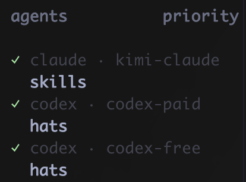

# Advanced configuration

Use these options for company gateways, local models, shared environment files, or
profiles that need separate CLI homes.

## Company gateway

Create the hat, add the gateway variables, and run it:

```bash
hats add company-claude claude
hats edit
hats run company-claude
```

Add the variables to `~/.config/hats/config.toml`:

```toml
[profiles.company-claude]
launch = "claude"
env = {
  ANTHROPIC_BASE_URL = "https://gateway.example",
  ANTHROPIC_AUTH_TOKEN = "file:~/.config/hats/company.token"
}
```

## Share a gateway between Claude and Codex

Share the gateway URL through one env file, then reference each credential separately:

```toml
[profiles.company-claude]
launch = "claude"
env_file = "~/.config/hats/company.env"
env = {
  ANTHROPIC_BASE_URL = "${COMPANY_AI_URL}",
  ANTHROPIC_AUTH_TOKEN = "file:~/.config/hats/anthropic.token"
}

[profiles.company-codex]
launch = "codex"
env_file = "~/.config/hats/company.env"
env = {
  OPENAI_BASE_URL = "${COMPANY_AI_URL}/v1",
  OPENAI_API_KEY = "file:~/.config/hats/openai.key"
}
```

```dotenv
# ~/.config/hats/company.env
COMPANY_AI_URL=https://gateway.example
```

## Local AI model

Run a local Claude-compatible CLI without inheriting a company gateway:

```bash
hats add local-claude ollama launch claude --model your-model
hats run local-claude
```

## Active hat indicators

hats exposes the selected profile through several independent indicators:

| Indicator | `hats run` | `hats exec` | Lifetime |
| --- | --- | --- | --- |
| Launch banner | yes | yes | printed once |
| Child `HATS_PROFILE` environment variable | yes | yes | child process |
| Herdr `$hat` metadata | yes | no | while the launched command runs |
| tmux pane option `@hats_profile` | yes | no | while the launched command runs |

`HATS_PROFILE` always contains the actual profile key. It overrides inherited values,
env files, and inline profile env values with the same name.

### tmux pane borders

Inside tmux, `hats run` exposes the active profile as the pane option `@hats_profile`
until the command exits. For example, add this to `~/.tmux.conf` and adapt it to your layout:

```tmux
set -g pane-border-status top
set -g pane-border-format ' #{@hats_profile} '
```

### Herdr sidebar

When a hat runs inside a Herdr pane, hats reports its name as the `$hat` metadata token.
Show it in the Agent sidebar with:



```toml
[ui.sidebar.agents]
rows = [
  ["state_icon", "agent", "$hat"],
  ["workspace", "tab"],
]
```

## Configuration file

hats stores its config at `~/.config/hats/config.toml`:

```toml
version = 1

[profiles.codex]
launch = "codex"

[profiles.codex-personal]
launch = "codex"
env = { CODEX_HOME = "~/.config/hats/homes/codex-personal" }

[profiles.company-claude]
launch = "claude"
env = {
  ANTHROPIC_BASE_URL = "https://gateway.example",
  ANTHROPIC_AUTH_TOKEN = "file:~/.config/hats/company.token"
}

[profiles.local-claude]
launch = "ollama launch claude --model your-model"
```

Set `HATS_HOME` to use a different config directory.

### Value references

hats reads credential references at run time and does not copy their contents into its
config.

The `env:`, `file:`, and `cmd:` references are supported only in inline `env` values.
In `env_file`, those prefixes remain literal, while a leading `~/` and `$VAR` or
`${VAR}` references are expanded.

| Prefix | Source |
| --- | --- |
| `env:NAME` | current environment variable |
| `file:path` | file contents, trimmed |
| `cmd:<shell>` | command stdout |
| none | plaintext |

`hats which` masks referenced values and does not execute `cmd:` references.

## Environment isolation

Before hats starts the child process, it strips inherited AI-provider variables:

```text
ANTHROPIC_*
CLAUDE_*
CODEX_*
OPENAI_*
GEMINI_*
GOOGLE_API_KEY
GOOGLE_GENERATIVE_AI_API_KEY
```

It then applies the profile's env file and inline variables. Non-provider variables such
as `OLLAMA_HOST`, proxy settings, `EDITOR`, and locale stay intact.

## Separate CLI state

By default, a hat shares the tool's normal config directory. Add `--isolated` when the
profile needs its own supported config home:

| Launch starts with | Env var set by `--isolated` |
| --- | --- |
| `codex` | `CODEX_HOME` |
| `claude` | `CLAUDE_CONFIG_DIR` |

This separates local CLI state; it does not guarantee that multiple OAuth subscriptions
can coexist. `--isolated` only infers from a bare `codex` or `claude` first token. Set
the config-home environment variable by hand for wrappers and custom launchers.
